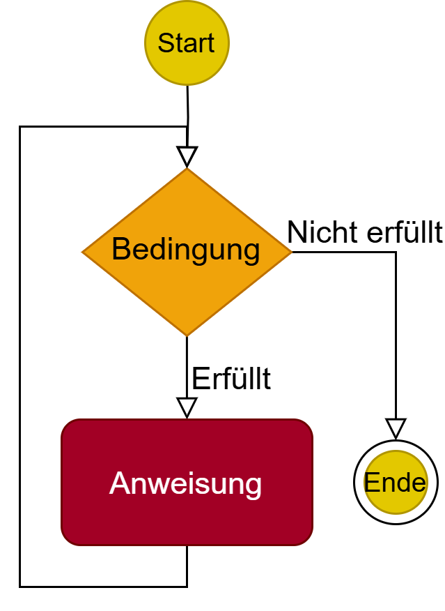
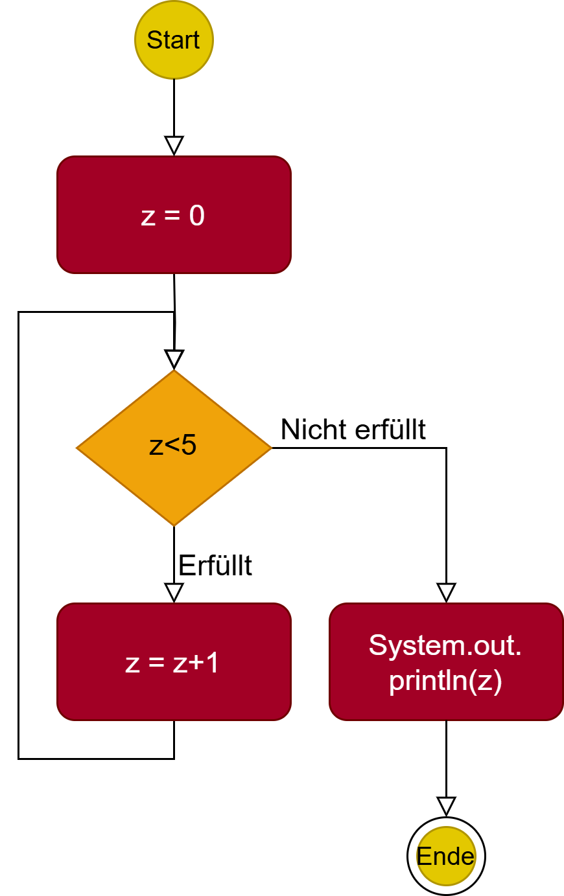

<!--
author: Melanie Baur, Hochschule für Technik Stuttgart, contact: melanie.baur@hft-stuttgart.de
language: de
version: 0.1
narrator: Deutsch Female
mode: Textbook

comment: Beispielseite zur Vorlesung Programmieren 1 an der HFT Stuttgart

import: https://raw.githubusercontent.com/liascript/CodeRunner/master/README.md

-->
# Programmieren 1 in Java
<article>
Dieses Online-Buch (kurz: Workbook) wird entwickelt an der Hochschule für Technik Stuttgart und dient der Einführung in die Programmierung mit Java im Rahmen der Vorlesung "Programmieren 1". Ursprünglich wurde es entwickelt für den Studiengang Informatik im 1. Semester um der Heterogenität dieser Studienkohorte gerecht zu werden. Inzwischen wird es darüber hinaus genutzt in den Studiengängen Wirtschaftsinformatik, AR/VR-Engineering, Digitalisierung und Informationsmanagement, Angewandte Mathematik und KI. 

Es werden keine Vorkenntnisse im Programmieren vorausgesetzt. Sie können also direkt beginnen!

Das Buch wird laufend ergänzt und verbessert, mit dem Ziel eine Open Eduactional Ressource (OER) bereitzustellen. 

Als Arbeitsweise wird für die Teilnehmenden der oben genannten Vorlesungen vorgeschlagen, jede Woche ein Kapitel durchzuarbeiten inkl. der zur Verfügung stehenden Programmieraufgaben. Der geschätze Zeitaufwand beträgt ohne Vorkenntnisse pro Woche 16 Stunden. Hiervon werden normalerweise 6 Stunden an der Hochschule erbracht, ein:e Professor:in und/oder ein:e Assistent:in stehen hierbei für Fragen zur Verfügung. 10 Stunden sollen selbständig absolviert werden. Dieser Zeitaufwand entspricht dem europäischen Referenzrahmen für die zu erhaltenen Credit Points. 

Lesen Sie gerne ein "echtes" Buch? So empfehlen wir die Lektüre von Philipp Ackermann: Schrödinger programmiert Java, Rheinwerk. Sie finden dieses Buch als eBook in der HFT Bibliothek.

Die wichtigsten Informationen finden Sie aber alle in diesem Workbook. Dieses besteht nicht nur aus Text, sondern auch aus Links zu externen Webseiten. Für diese übernehmen wir keinerlei Haftung. Weiterhin gibt es natürlich viele Code-Beispiele. Diese können Sie direkt im Online-Buch ausführen. Wenn Sie etwas weiter fortgeschritten sind, kommt eine integrierte Entwicklungsumgebung (IDE) zum Einsatz.

Zum Beispiel ist das folgende ein Programm-Code, bei dem etwas auf der Konsole ausgegeben wird.

```java
class HalloWelt{
    public static void main(String args[]){
        System.out.println("Hallo Welt");
    }
}
```
@LIA.java(HalloWelt)

Klicken Sie nun auf </> im kleinen Kreis unter der Code-Zeile, so wird der Code ausgeführt und Sie sehen im schwarzen Kästchen, das dann erscheint, das Ergebnis.

</article>

Natürlich sollen Sie nicht nur lesen, sondern insbesondere auch viel selbst machen. Hier kommt die erste Aufgabe.

**Aufgabe:**

Geben Sie nun statt "Hallo Welt" einen anderen Text zwischen den Anführungszeichen ein. Führen Sie den Code erneut aus. Was fällt Ihnen auf?

Auf der rechten Seiten unterhalb des Codes, können Sie nun mit den Pfeilen zwischen den verschiedenen Codes hin- und herwechseln. Gehen Sie mit dem Pfeil nach links zurück auf den ursprünglichen Code und dann mit dem Pfeil nach rechts wieder zu Ihrem neuen Code.


**Übungen:**

Um viel zu üben, denn das ist das wichtigste beim Programmieren, werden zu jedem Kapitel weitere Übungen bereit gestellt. Sie werden im Laufe des Buchs immer wieder zu diesen Übungen aufgefordert. Führen Sie die Aufgaben gewissenhaft aus. Bei Problemen fragen Sie einfach in der nächsten Mentoringstunde. 

>**Hinweis für die Jury des Landeslehrpreises:** 

Als Ergänzung gibt es für die Studierenden eine Aufgabensammlung mit zahlreichen Aufgaben und Lösungen, welche diese über eine Webseite aufrufen können. Der Link hierzu wird am Anfang des Semester den Studierenden bekannt gegeben. Die Lösungen werden nach Bearbeitung der Aufgaben dann freigeschaltet.


## Kontrollfluss

Der Kontrollfluss in Java ermöglicht es uns, den Ablauf unseres Codes zu steuern, indem wir Entscheidungen treffen, Verzweigungen und Schleifen verwenden. Kontrollflussstrukturen wie bedingte Anweisungen und Schleifen ermöglichen es uns, unseren Code dynamisch zu gestalten und verschiedene Pfade je nach Bedingungen oder Anforderungen auszuführen.

Schauen Sie sich folgendes Beispiel an und überlegen Sie sich für jede Zeile, was das Programm tun könnte und welche Ausgabe der Code Ihrer Meinung nach erzeugt.

```java
class DemoKontrollfluss{
    public static void main(String args[]){
        int zahl = 10;

        if (zahl % 2 == 0) {
            System.out.println(zahl + " ist eine gerade Zahl.");
        } else {
            System.out.println(zahl + " ist eine ungerade Zahl.");
        }
        
        System.out.println("Zahlen von 1 bis 5:");
        for (int i = 1; i <= 5; i++) {
            System.out.println(i);
        }
    }
}
```
@LIA.java(DemoKontrollfluss)

Führen Sie nun den Code aus und überprüfen Sie Ihre Vermutung. Hatten Sie recht mit Ihrer Annahme?

Modifizieren Sie den Code so, dass als Ausgabe "11 ist eine ungerade Zahl" erscheint, sowie die Zahlen von 0 bis 3 ausgegeben werden.

Im Laufe dieses Kapitels schauen wir uns folgende Strukturen genauer an: 

* if-Verzweigungen
* if/else-Anweisungen
* switch/case-Statement
* for-Schleife (Zählschleife)
* for-each-Schleife (Mengenschleife)
* while-Schleife
* do-while-Schleife

>**Hinweis für die Jury des Landeslehrpreises:** 

Im Rahmen der Unterlagen für den Landeslehrpreis wird hier beispielhaft das Kapitel der while-Schleife ausgeführt und öffentlich zugänglich gemacht. Die kompletten Unterlagen des Stoffs für Programmieren 1 sind in diesem Stil ausgearbeitet und für die Studierenden zugänglich.


### Die while-Schleife
Die while-Schleife wird verwendet, um einen Codeblock wiederholt auszuführen, solange eine bestimmte Bedingung erfüllt ist. Die Bedingung wird vor jeder Ausführung des Codeblocks überprüft und muss ein boolescher Ausdruck sein. Der Ablauf ist in folgendem Bild dargestellt.

<p align="center">

</p>


Schauen Sie sich nun folgendes Codebeispiel an an. Was passiert hier?

```java
class While{
    public static void main(String args[]){
        int zaehler = 15;
        while (zaehler < 20) {
            System.out.println(zaehler);
            zaehler++;
        }
    }
}
```
@LIA.java(While)

Überprüfen Sie Ihre Vermutung, in dem Sie das Programm ausführen. 

Können Sie es so modifizieren, dass alle geraden Zahlen ausgegeben werden?


<p align="center">

</p>

Können Sie obiges Bild als Code darstellen?

```java
class WhileBeispiel{
    public static void main(String args[]){

       
    }
}
```
@LIA.java(WhileBeispiel)

Führen Sie Ihr Programm aus und vergleichen Sie es mit der Grafik. Haben Sie alles korrekt umgesetzt?

>**Anmerkungen**

- Die Bedingung der `while`-Schleife wird vor der Ausführung des Codeblocks überprüft. Wenn die Bedingung falsch ist, wird der Codeblock nicht ausgeführt und die Schleife wird beendet.
- Es ist wichtig, sicherzustellen, dass sich die Bedingung im Verlauf der Schleife ändert, um eine Endlosschleife zu vermeiden.
- `break` kann verwendet werden, um die Schleife vorzeitig zu beenden, und `continue` springt zum nächsten Schleifendurchlauf.

Die `while`-Schleife ist besonders nützlich, wenn die Anzahl der Iterationen im Voraus nicht bekannt ist, sondern von einer Bedingung abhängt.


>**Quiz** 

Was ist die Hauptfunktion einer while-Schleife in Java?

[(x)] Sie führt eine Codeblock aus, solange eine Bedingung wahr ist.
[( )] Sie führt immer mindestens eine Iteration aus, auch wenn die Bedingung falsch ist.
[( )] Sie iteriert durch ein Array ohne zusätzliche Bedingungen.

Was passiert, wenn die Bedingung einer while-Schleife niemals falsch wird?

[( )] Der Compiler wirft einen Fehler und die Schleife wird nicht kompiliert.
[( )] Der Programmcode springt automatisch zur nächsten Schleife.
[(x)] Die Schleife läuft unendlich lange weiter (Endlosschleife).

Welche der folgenden Deklarationen ist eine gültige while-Schleife in Java?

[( )] `while i < 10 { System.out.println(i); i++; }`
[(x)] `while (i < 10) { System.out.println(i); i++; }`
[( )] `while (i < 10) System.out.println(i); i++; end;`


### Beispiele

Machen Sie sich mit folgendem Coding vertraut und überlegen Sie, was die Ausgabe ist. 

```java
public class AnwendungFor {
	public static void main(String[] args) {
		for (int i = 1 ; i < 4 ; i = i + 1) {
			System.out.println("i = " + i);
		}
	}
}
```
@LIA.java(AnwendungFor)

Überprüfen Sie Ihre Vermutung, in dem Sie das Programm ausführen.

Überlegen Sie danach, wie Sie obigen Code in eine äquivalente `while`-Schleife umbauen können.

```java
public class Ueberlegung{
	public static void main(String[] args) {
    // hier können Sie die Schleifen ausprobieren
    
	}
}
```
@LIA.java(Ueberlegung)

Die Lösungen für die `while`-Schleife finden Sie hier:

```java
public class Anwendung1_While{
	public static void main(String[] args) {
		int i = 1;	
		while (i < 4) {
			System.out.println("i = " + i);
			i = i + 1; // oder kurz: i++
		}
	}
}
```
@LIA.java(Anwendung1_While)


Nun schauen wir den Ersatz einer `if`-Bedingung durch eine `while`-Schleife an:

```java
public class Anwendung1_If {
	public static void main(String[] args) {
		int i = 3;
		if (i < 18) {
			System.out.println("noch nicht volljährig");
		}
	}
}
```
@LIA.java(Anwendung1_If)

Was macht dieses Programm? 

Bauen Sie nun obiges Programm so um, dass das selbe Ergebnis herauskommt. Verwenden Sie nun ausschließlich eine `while`-Schleife. 

```java
public class Ueberlegung2{
	public static void main(String[] args) {
    // hier können Sie die while-Schleife ausprobieren

    }	
}
```
@LIA.java(Ueberlegung2)

Überprüfen Sie Ihr Programm. Stimmt es auch für verschiedene Eingaben von `i`?

Hier finden Sie die Lösung:

```java
public class Anwendung2_While{
	public static void main(String[] args) {
		int i = 3;
		boolean nurEinmal = true;

		while (i < 18 && nurEinmal == true) {
			System.out.println("noch nicht volljährig");
			nurEinmal = false;
		}
	}
}
```
@LIA.java(Anwendung2_While)

Wenn Sie diese Beispiele verstanden haben, können Sie zu den Übungen weiter gehen.

### Übungen

**Zahlensumme**  

Berechnen Sie die Summe aller Zahlen von 0 bis zu einer vorgegebenen größten Zahl. Für das Beispiel 5 wäre das also 0+1+2+3+4+5 = 15.

Lösen Sie das Problem auf mindestens drei verschiedene Arten. 

**Euklid** 

Gegeben ist die folgende Berechnungsvorschrift für den größten gemeinsamen Teiler (ggT) zweier nichtnegativer ganzer Zahlen:

```
wenn a = 0
dann ist das Ergebnis b
sonst solange b ≠ 0
    wenn a > b
    dann a = a – b
    sonst b = b – a
das Ergebnis ist a
```

Schreiben Sie diese nach Euklid benannte Vorschrift in ein Programm um, das (nach Eingabe zweier nichtnegativer ganzer Zahlen) zählt, wie viele Runden das Verfahren benötigt, um den ggT zu berechnen.

**Pincodes**

In dieser Aufgabe sollen alle vierstelligen PINs einer Bankkarte erzeugt und in der Konsole ausgegeben werden. 

Schreiben Sie dazu ein Programm, das diese Aufgabe umsetzt. 

Tipp:
* Prüfen Sie zunächst, ob die Zahl ein-, zwei-, oder dreistellig ist, und fügen Sie ggf. voranstehende Nullen hinzu.

Die Ausgabe sollte wie folgt aussehen:

```
0000
0001
0002
0003
0004
...
9997
9998
9999
```

>**Weitere Aufgaben:**  

Weiterführende Aufgaben und die Lösungen zu obigen Aufgaben finden Sie in der Aufgaben-Datenbank in Kapitel 2. 


### Ablage 

Wann wird welche Schleife verwendet?

* while -> Anzahl Durchläufe ist zu Beginn unbekannt
* for -> Anzahl Durchläufe ist zu Beginn bekannt	
* for each -> Zugriff auf die Elemente einer Menge
* do-while -> Anzahl Durchläufe ist zu Beginn unbekannt, aber ein Durchlauf ist mindestens notwendig

