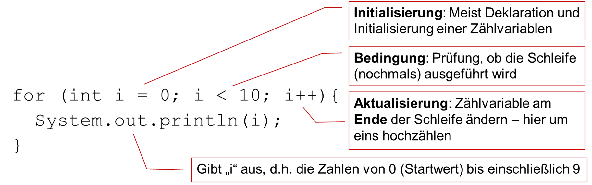
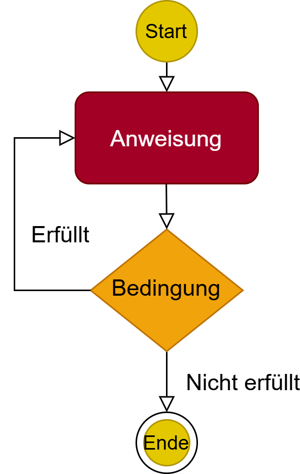

<!--
author: Melanie Baur, Hochschule für Technik Stuttgart, contact: melanie.baur@hft-stuttgart.de
language: de
version: 1.0
narrator: Deutsch Female
mode: Textbook

comment: Beispielseite zur Vorlesung Programmieren 1 an der HFT Stuttgart

import: https://raw.githubusercontent.com/liascript/CodeRunner/master/README.md

-->
# Programmieren 1 in Java
<article>
Dieses Online-Buch (kurz: Workbook) wird entwickelt an der Hochschule für Technik Stuttgart und dient der Einführung in die Programmierung mit Java im Rahmen der Vorlesung "Programmieren 1". Ursprünglich wurde es entwickelt für den Studiengang Informatik im 1. Semester um der Heterogenität dieser Studienkohorte gerecht zu werden. Inzwischen wird es darüber hinaus genutzt in den Studiengängen Wirtschaftsinformatik, AR/VR-Engineering, Digitalisierung und Informationsmanagement, Angewandte Mathematik und KI. 

Es werden keine Vorkenntnisse im Programmieren vorausgesetzt. Sie können also direkt beginnen!

Das Buch wird laufend ergänzt und verbessert, mit dem Ziel eine Open Eduactional Ressource (OER) bereitzustellen. 

Als Arbeitsweise wird für die Teilnehmenden der oben genannten Vorlesungen vorgeschlagen, jede Woche ein Kapitel durchzuarbeiten inkl. der zur Verfügung stehenden Programmieraufgaben. Der geschätze Zeitaufwand beträgt ohne Vorkenntnisse pro Woche 16 Stunden. Hiervon werden normalerweise 6 Stunden an der Hochschule erbracht, ein:e Professor:in und/oder ein:e Assistent:in stehen hierbei für Fragen zur Verfügung. 10 Stunden sollen selbständig absolviert werden. Dieser Zeitaufwand entspricht dem europäischen Referenzrahmen für die zu erhaltenen Credit Points. 

Lesen Sie gerne ein "echtes" Buch? So empfehlen wir die Lektüre von Philipp Ackermann: Schrödinger programmiert Java, Rheinwerk. Sie finden dieses Buch als eBook in der HFT Bibliothek.

Die wichtigsten Informationen finden Sie aber alle in diesem Workbook. Dieses besteht nicht nur aus Text, sondern auch aus Links zu externen Webseiten. Für diese übernehmen wir keinerlei Haftung. Weiterhin gibt es natürlich viele Code-Beispiele. Diese können Sie direkt im Online-Buch ausführen. Wenn Sie etwas weiter fortgeschritten sind, kommt eine integrierte Entwicklungsumgebung (IDE) zum Einsatz.

Zum Beispiel ist das folgende ein Programm-Code, bei dem etwas auf der Konsole ausgegeben wird.

```java
class HalloWelt {
    public static void main(String args[]) {
        System.out.println("Hallo Welt");
    }
}
```
@LIA.java(HalloWelt)

Klicken Sie nun auf </> im kleinen Kreis unter der Code-Zeile, so wird der Code ausgeführt und Sie sehen im schwarzen Kästchen, das dann erscheint, das Ergebnis.

</article>

Natürlich sollen Sie nicht nur lesen, sondern insbesondere auch viel selbst machen. Hier kommt die erste Aufgabe.

**Aufgabe:**

Geben Sie nun statt "Hallo Welt" einen anderen Text zwischen den Anführungszeichen ein. Führen Sie den Code erneut aus. Was fällt Ihnen auf?

Auf der rechten Seiten unterhalb des Codes, können Sie nun mit den Pfeilen zwischen den verschiedenen Codes hin- und herwechseln. Gehen Sie mit dem Pfeil nach links zurück auf den ursprünglichen Code und dann mit dem Pfeil nach rechts wieder zu Ihrem neuen Code.


**Übungen:**

Um viel zu üben, denn das ist das wichtigste beim Programmieren, werden zu jedem Kapitel weitere Übungen bereit gestellt. Sie werden im Laufe des Buchs immer wieder zu diesen Übungen aufgefordert. Führen Sie die Aufgaben gewissenhaft aus. Bei Problemen fragen Sie einfach in der nächsten Mentoringstunde. 

>**Hinweis für die Jury des Landeslehrpreises:** Als Ergänzung gibt es für die Studierenden eine Aufgabensammlung mit zahlreichen Aufgaben und Lösungen, welche diese über eine Webseite aufrufen können. Der Link hierzu wird am Anfang des Semester den Studierenden bekannt gegeben. Die Lösungen werden nach Bearbeitung der Aufgaben dann freigeschaltet.


## Kontrollfluss

>**Hinweis für die Jury des Landeslehrpreises:** Im Rahmen der Unterlagen für den Landeslehrpreis wird hier beispielhaft das Kapitel der Schleifen ausgeführt und öffentlich zugänglich gemacht. Die kompletten Unterlagen des Stoffs für Programmieren 1 sind in diesem Stil ausgearbeitet und für die Studierenden zugänglich. 


Der Kontrollfluss in Java ermöglicht es uns, den Ablauf unseres Codes zu steuern, indem wir Entscheidungen treffen, Verzweigungen und Schleifen verwenden. Kontrollflussstrukturen wie bedingte Anweisungen und Schleifen ermöglichen es uns, unseren Code dynamisch zu gestalten und verschiedene Pfade je nach Bedingungen oder Anforderungen auszuführen.

Schauen Sie sich folgendes Beispiel an und überlegen Sie sich für jede Zeile, was das Programm tun könnte und welche Ausgabe der Code Ihrer Meinung nach erzeugt.

```java
class DemoKontrollfluss {
    public static void main(String args[]) {
        int zahl = 10;

        if (zahl % 2 == 0) {
            System.out.println(zahl + " ist eine gerade Zahl.");
        } else {
            System.out.println(zahl + " ist eine ungerade Zahl.");
        }
        
        System.out.println("Zahlen von 1 bis 5:");
        for (int i = 1; i <= 5; i++) {
            System.out.println(i);
        }
    }
}
```
@LIA.java(DemoKontrollfluss)

Führen Sie nun den Code aus und überprüfen Sie Ihre Vermutung. Hatten Sie recht mit Ihrer Annahme?

Modifizieren Sie den Code so, dass als Ausgabe "11 ist eine ungerade Zahl" erscheint, sowie die Zahlen von 0 bis 3 ausgegeben werden.

Im Laufe dieses Kapitels schauen wir uns folgende Strukturen, die im obigen Code schon vorkommen, genauer an, so dass Sie alle verstehen und einsetzen können: 

* if-Verzweigungen
* if/else-Anweisungen
* switch/case-Statement
* **for-Schleife (Zählschleife)**
* **for-each-Schleife (Mengenschleife)**
* **while-Schleife**
* **do-while-Schleife**

Die **fett** gedruckten Unterkapitel sind dabei Teil des öffentlichen Workbooks.


### Die for-Schleife

Schleifen werden genutzt um einen Java-Block öfters zu wiederholen. Die erste Schleife, die wir hier erklären, ist die `for`-Schleife. In dieser Schleife wird der auszuführende Code im Schleifenkörper von einer Anfangszahl bis zu einer Endzahl mit einer vorgegebenen Schrittweite wiederholt. Schauen Sie hierzu folgendes Bild an. 


<p align="center">

</p>


Die allgemeine Syntax für die `for`-Schleife lautet: 

```
for (Initialisierung; Bedingung; Aktualisierung) {
  // Hier passiert dann irgendetwas 
  // Diesen Block nennt man Schleifenkörper
} 
```

Im Code sieht dies dann so aus: Was ist das Ergebnis?

```java
class ForSyntax {
    public static void main(String args[]) {
        for (int i = 0; i < 10; i++){
          System.out.println(i);
        }
    }
}
```
@LIA.java(ForSyntax)


Was müssen Sie abändern, um auch die Zahl 10 ausgeben zu lassen?

Betrachten Sie nun folgendes Beispiel: 

```java
class ForBeispiel {
    public static void main(String args[]) {
        int n = 4;
        int fakultaet = 1;
        for(int i = 1; i<=n; i++) {
            fakultaet *= i;
        }
        System.out.println(n + "! = " + fakultaet);
    }
}
```
@LIA.java(ForBeispiel)

Wie sieht hier die Ausgabe aus? 

Können Sie obiges Programm so abändern, dass die Zahlensumme von 1 bis 5 berechnet wird? Die Lösung finden Sie untenstehend.

```java
class ForZahlensumme{
    public static void main(String args[]){
        int n = 5;
        int summe = 0; // Bei 0 starten!
        for(int i = 1; i<=n; i++) {
            summe += i; // Aufsummieren statt multiplizieren
        }
        System.out.println("Zahlensumme: " + summe);
    }
}
```
@LIA.java(ForZahlensumme)

>**Anmerkungen:**

- Eine im Schleifenkopf deklarierte Variable ist nur innerhalb der Schleife sichtbar.
- Teile des Kopfes können leer bleiben. Z.B. stellt for(;;) eine Endlosschleife dar. Es gibt keine Bedingung, die die Schleife stoppt. 
- Man kann Schleifen auch schachteln. 
- Das Schlüsselwor `break` verlässt die Schleife sofort.
- Das Schlüsselwort `continue` überspringt den aktuellen Schleifendurchlauf und fährt mit dem nächsten Durchlauf fort

Zähler modifizieren: 

- Statt `zaehler=zaehler + 1` kann man auch `zaehler++` schreiben
- Analog gibt es auch `zaehler–-`, dies entspricht `zaehler -= 1`
- Sie können die Zähler auf jede beliebige Art und Weise modifizieren, z.B. `zaehler += 2`, `zaehler -= 5`, `zaehler *= i` etc.
 
>**Quiz:** 

Welche der folgenden for-Schleifen zählt von 1 bis einschließlich 5?

[( )]  `for (int i = 0; i < = 5; i++)`
[(X)]  `for (int i = 1; i < = 5; i++)`
[( )]  `for (int i = 1; i < 5; i++)`

Was ist das Ergebnis dieser Schleife?

```
for (int i = 0; i < 3; i++) {
    System.out.print(i + " ");
}
```

[( )]  1 2 3
[(X)]  0 1 2
[( )]  0 1 2 3

Welche Komponente einer for-Schleife ist nicht erforderlich, damit diese richtig kompiliert wird?

[( )] Die Initialisierung
[( )] Die Bedingung
[(X)] Keine ist zwingend, alle Teile können weggelassen werden


>**Übung:**

Schreiben Sie ein Programm, dass alle geraden Zahlen von 20 bis 40 ausgibt. Nutzen Sie hierfür eine for-Schleife. Überlegen Sie sich dazu, wie Sie überprüfen können, ob eine Zahl gerade ist. 

```java
class GeradeZahlen {
    public static void main(String args[]) {


    }
}
```
@LIA.java(GeradeZahlen)


Schreiben Sie nun ein Programm, dass einen Countdown ausgibt. Dabei soll von 10 bis 1 rückwärts gezählt werden. Wenn der Countdown endet, soll die Nachricht `Start` ausgegeben werden.

```java
class Countdown {
    public static void main(String args[]) {


    }
}
```
@LIA.java(Countdown)


Hier können Sie Ihre Lösung von oben vergleichen:

```java
class LoesungGeradeZahlen {
    public static void main(String args[]) {
        for (int i = 20; i <= 40; i++) {
            if (i % 2 == 0) {
                System.out.println(i);
            }
        }
    }
}
```
@LIA.java(LoesungGeradeZahlen)

```java
class LoesungCountdown {
    public static void main(String args[]) {
        for (int i = 10; i > 0; i--) {
            System.out.println(i);
        }
        System.out.println("Start");
    }
}
```
@LIA.java(LoesungCountdown)


### Die for-each-Schleife

Die `for-each`-Schleife benötigt eine Sammlung gleichartiger Objekte. Ein Array ist ein Beispiel hierfür. Auch im Kapitel `Collections` werden wird diese Art von Schleife ausgiebig nutzen. 

Die `for-each`-Schleife führt den Rumpf für jedes Element der angegebenen Menge aus. Es ist somit nicht erforderlich einen Index oder die Größe des Arrays zu berücksichtigen. Dies hilft, Fehler zu vermeiden. 

Die `for-each`-Schleife hat folgende Syntax:

```
for (Datentyp element : sammlung) {
  // Hier passiert dann irgendetwas mit den Elementen der Sammlung 
} 
```

Schauen Sie sich folgendes Beispiel für die `for-each`-Schleife an und überlegen Sie sich folgende Fragen:

* Welchen Datentyp haben die Elemente, über die iteriert wird?
* Wie sieht die "Sammlung" der Elemente aus?
* Was könnte der Output dieses Codes sein?

```java
class ForEachSyntax {
    public static void main(String args[]) {
        String[] array = {"eins", "zwei", "drei"}; 
        for (String wort : array) {
            System.out.println(wort);
        }
    }
}
```
@LIA.java(ForEachSyntax)

Führen Sie nun den Code aus.

In der "Sammlung" befinden sich die drei Strings "eins", "zwei", "drei". Alle Elemente der Sammlung werden ausgegeben. 

Modifizieren Sie obigen Code so, dass auch die Wörter "null" und "vier" ausgegeben werden. 

Erstellen Sie nun ein eigenes Beispiel, das die Zahlen 1, 2, 3 ausgibt, jeweils in einer neuen Zeile. Nutzen Sie hierfür ein integer-Array und die for-each-Schleife. 


```java
class ForEachUebung {
    public static void main(String args[]) {
        // Legen Sie zunächst ein integer-Array an: int[] ...

        // Iterieren Sie dann mit Hilfe der for-each-Schleife über das Array
        
    }
}
```
@LIA.java(ForEachUebung)

Hat alles geklappt? Dann finden Sie hier die Lösung:

```java
class LoesungForEachUebung {
    public static void main(String args[]) {
        int[] zahlen = {1,2,3}; 
        for (int zahl : zahlen) {
            System.out.println(zahl);
        }
    }
}
```
@LIA.java(LoesungForEachUebung)


>**Nutzung der for-each-Schleife:**

Die for-each-Schleife kann genutzt werden, wenn:

* Über alle Elemente einer Sammlung iteriert werden soll
* Der Index des jeweiligen Elements nicht benötigt wird
* Die Sammlung sich während der Iteration nicht verändert


>**Erklärung für Fortgeschrittene, die bereits Collections kennen:**

Intern wird bei der for-each-Schleife ein Iterator benutzt, welcher automatisch durch die Sammlung der gleichartigen Objekte zählt und die Schleife beendet, wenn alle Elemente durchlaufen sind. Somit kann eine for-each-Schleife nicht nur für Arrays, sondern für alle Klassen benutzt werden, die das Interface java.lang.Iterable implementieren. In der Java API Specification finden Sie hierzu weitere Details: [Java API](https://docs.oracle.com/en/java/javase/21/docs/api/java.base/java/lang/Iterable.html)

>**Quiz:** 

Welche der folgenden Schleifen ist eine gültige for-each-Schleife?

[( )] `for (int i = 0; i < array.length; i++)`
[(X)] `for (int element : array)`
[( )] `for (array : int element)`


Was ist eine typische Einschränkung der for-each-Schleife?

[( )] Sie kann keine Arrays durchlaufen. 
[( )] Sie kann nur über Listen iterieren.
[(X)] Sie erlaubt keinen Zugriff auf den Index des Elements.

Was berechnet die folgende Schleife?

```
int[] zahlen = {1, 2, 3};
for (int zahl : zahlen) {
    System.out.print(zahl + " ");
}
```

[( )] Es wird „123“ ohne Leerzeichen ausgegeben.
[(X)] Es wird „1 2 3 “ mit Leerzeichen ausgegeben.
[( )] Es wird ein Fehler angezeigt, da for-each keine Arrays unterstützt.


>**Übung:**

Gegeben ist folgender Programmcode. Schauen Sie sich zuerst an, welche Datenstruktur vorgegeben ist. 


```java
class Lieblingsessen {
    public static void main(String args[]) {
    String[][] lieblingsgerichte = {
            {"Ada Lovelace", "Fish", "Mash", "Cawl"},
            {"Joseph Weizenbaum", "Hühnchen", "Kartoffeln", "Karotten"},
            {"Edsger Dijkstra", "Stamppot", "Kaasstengels", "Erwtensoep"}
        };
    }
}
```
@LIA.java(Lieblingsessen)

Bei den drei Personen handelt es sich um berühmte Informatiker. Versuchen Sie herauszufinden, für was diese berühmt geworden sind. 

Ergänzen Sie den Code nun mit einer äußeren for-each-Schleife und einer inneren for-Schleife so, dass für jeden Informatiker die Lieblingsgerichte ausgegeben werden in der Form: 

```
Ada Lovelace: 
- Fisch
- Mash
- Cawl
```

Untenstehend kommt die Lösung:

```java
class LoesungLieblingsessen {
    public static void main(String args[]) {
    String[][] lieblingsgerichte = {
            {"Ada Lovelace", "Fish", "Mash", "Cawl"},
            {"Joseph Weizenbaum", "Hühnchen", "Kartoffeln", "Karotten"},
            {"Edsger Dijkstra", "Stamppot", "Kaasstengels", "Erwtensoep"}
        };

        for (String[] person : lieblingsgerichte) {
            System.out.println(person[0] + ": ");
            for (int i = 1; i < person.length; i++) {
                System.out.println("- " + person[i]);
            }
            System.out.println();
        }   
    }
}
```
@LIA.java(LoesungLieblingsessen)


### Die while-Schleife

Die `while`-Schleife wird verwendet, um einen Codeblock wiederholt auszuführen, solange eine bestimmte Bedingung erfüllt ist. Die Bedingung wird vor jeder Ausführung des Codeblocks überprüft und muss ein boolescher Ausdruck sein. Der Ablauf ist in folgendem Bild dargestellt.

<p align="center">

</p>


Die while-Schleife hat folgende Syntax:

```
while (Bedingung) {
  Anweisung;
} 
```

Schauen Sie sich nun folgendes Codebeispiel an an. Was passiert hier?

```java
class WhileSyntax {
    public static void main(String args[]){
        int zaehler = 15;
        while (zaehler < 20) {
            System.out.println(zaehler);
            zaehler++;
        }
    }
}
```
@LIA.java(WhileSyntax)

Überprüfen Sie Ihre Vermutung, indem Sie das Programm ausführen. 

Können Sie es so modifizieren, dass nur die geraden Zahlen im relevanten Bereich ausgegeben werden?


<p align="center">

</p>

Können Sie obiges Bild als Code darstellen?

```java
class WhileBildAlsCode {
    public static void main(String args[]){

       
    }
}
```
@LIA.java(WhileBildAlsCode)

Führen Sie Ihr Programm aus und vergleichen Sie es mit der Grafik. Haben Sie alles korrekt umgesetzt? Welches Ergebnis erhalten Sie?

>**Anmerkungen:**

- Die Bedingung der `while`-Schleife wird vor der Ausführung des Codeblocks überprüft. Wenn die Bedingung falsch ist, wird der Codeblock nicht ausgeführt und die Schleife wird beendet.
- Es ist wichtig, sicherzustellen, dass sich die Bedingung im Verlauf der Schleife ändert, um eine Endlosschleife zu vermeiden.
- `break` kann verwendet werden, um die Schleife vorzeitig zu beenden, und `continue` springt zum nächsten Schleifendurchlauf.

Die `while`-Schleife ist besonders nützlich, wenn die Anzahl der Iterationen im Voraus nicht bekannt ist, sondern von einer Bedingung abhängt.


>**Quiz:** 

Was ist die Hauptfunktion einer while-Schleife in Java?

[(x)] Sie führt eine Codeblock aus, solange eine Bedingung wahr ist.
[( )] Sie führt immer mindestens eine Iteration aus, auch wenn die Bedingung falsch ist.
[( )] Sie iteriert durch ein Array ohne zusätzliche Bedingungen.

Was passiert, wenn die Bedingung einer while-Schleife niemals falsch wird?

[( )] Der Compiler wirft einen Fehler und die Schleife wird nicht kompiliert.
[( )] Der Programmcode springt automatisch zur nächsten Schleife.
[(x)] Die Schleife läuft unendlich lange weiter (Endlosschleife).

Welche der folgenden Deklarationen ist eine gültige while-Schleife in Java?

[( )] `while i < 10 { System.out.println(i); i++; }`
[(x)] `while (i < 10) { System.out.println(i); i++; }`
[( )] `while (i < 10) System.out.println(i); i++; end;`


>**Übung:**

Gegeben sei eine Startzahl. Schreiben Sie ein Programm, das diese Zahl so lange durch 2 teilt, bis das Ergebnis kleiner 1 ist. Nutzen Sie hierfür eine while-Schleife und überlegen Sie sich, welchen Datentyp Sie für die Startzahl brauchen. Geben Sie den aktuellen Wert Ihrer Zahl bei jedem Schleifendurchlauf aus. Geben Sie ebenso aus, wie groß die Zahl am Ende ist. 

Testen Sie dann Ihre Lösung mit verschiedenen Startzahlen. 

```java
class Zahlenteilen {
    public static void main(String args[]){

       
    }
}
```
@LIA.java(Zahlenteilen)

Ergänzen Sie dann Ihr obiges Programm so, dass die Anzahl der Schleifen-Durchläufe, also wie oft die Zahl geteilt wurde, auf der Konsole ausgegeben wird. 


```java
class LoesungZahlenteilen {
    public static void main(String args[]){
        double startzahl = 100.0;
        int anzahlDurchlauefe = 0;

        while (startzahl >= 1.0) {
            System.out.println("Aktueller Wert: " + startzahl);
            startzahl = startzahl / 2;
            anzahlDurchlauefe++;
        }
        System.out.println("Zahl am Schlus: " + startzahl);
        System.out.println("Anzahl der Durchlauefe: " + anzahlDurchlauefe);      
    }
}
```
@LIA.java(LoesungZahlenteilen)


### Die do-while-Schleife
Die `do-while`-Schleife ist eine Schleife mit Test der Bedingung am Ende des Schleifenkörpers. Das bedeutet, die Schleife wird mindestens einmal durchlaufen. Der Ablauf ist in folgendem Bild dargestellt.

<p align="center">

</p>


Die Schleife wird solange durchlaufen, solange die Bedingung wahr ist. Wie immer muss die Bedingung ein boolescher Ausdruck sein. Weiterhin muss die Anweisung die Bedingung ändern, sonst erhält man eine Endlosschleife.

Die do-while-Schleife hat folgende Syntax:

```
do {
  Anweisung;
} while (Bedingung);
```

Schauen wir uns ein längeres Beispiel an. Welche Ausgabe erzeugt folgendes Beispiel?

```java
class DoWhileSyntax {
    public static void main(String args[]){
        int z = 0;
        do {
            System.out.println("Ausgabe ist: " + z);
            z = z+1;
        } while (z<5);

        System.out.println("-------------------");
        System.out.println("Zu Ende ist bei: " + z);     
    }
}
```
@LIA.java(DoWhileSyntax)

Führen Sie das Beispiel aus. Lagen Sie mit Ihrer Vermutung richtig?

Modifizieren Sie das Beispiel nun so, dass die Ausgabe wie folgt ist:

```
Ausgabe ist: 1
Ausgabe ist: 3
-------------------
Zu Ende ist bei: 5
```

>**Quiz** 

Was unterscheidet eine `do-while`-Schleife von einer `while`-Schleife?

[(x)] Die Bedingung wird nach dem Schleifenblock überprüft.
[( )] Die Schleife wird immer nur einmal ausgeführt.
[( )] Sie benötigt keine Bedingung, um ausgeführt zu werden.


Welcher Codebaustein führt immer zu einer Endlosschleife bei Verwendung einer `do-while`-Schleife?

[( )] `while (i > 0);`
[( )] `while (i < 10);`
[(x)] `while (true);`


>**Übung:**

Schreiben Sie mit Hilfe einer `do-while`-Schleife ein Programm, dass die Quadratzahlen bis zu einer vorgegeben Quadratzahl ausgibt. Testen Sie Ihr Programm mit verschiedenen Eingaben.

```java
class Quadratzahlen {
	public static void main(String[] args) {

	}
}
```
@LIA.java(Quadratzahlen)


```java
class LoesungQuadratzahlen {
	public static void main(String[] args) {
        int hoechsteQuadratzahl = 25;
        int startzahl = 1;
        int quadrat = 0;
        do {
            quadrat = startzahl * startzahl;
            System.out.println(quadrat); 
            startzahl++;
        } while (quadrat < hoechsteQuadratzahl);
         // Durch das zusätzliche Einfügen folgender beiden Zeilen, 
         // können Sie das Programm etwas besser nachvollziehen
         System.out.println("Quadrat am Ende: " + quadrat); 
         System.out.println("Startzahl am Ende: " + startzahl); 
	}
}
```
@LIA.java(LoesungQuadratzahlen)

### Beispiele

In diesem Abschnitt finden Sie nun weitere Beispiele und kleine Übungen für die bisher eingeführten Schleifen. 

Machen Sie sich mit folgendem Coding vertraut und überlegen Sie, was die Ausgabe ist. 

```java
class ForBeispiel {
	public static void main(String[] args) {
		for (int i = 1 ; i < 4 ; i = i + 1) {
			System.out.println("i = " + i);
		}
	}
}
```
@LIA.java(ForBeispiel)

Überprüfen Sie Ihre Vermutung, indem Sie das Programm ausführen.

Überlegen Sie danach, wie Sie obigen Code in eine äquivalente `while`-Schleife umbauen können. 

```java
class ForAlsWhileSchleife {
	public static void main(String[] args) {
    // hier können Sie die while-Schleife ausprobieren
    
	}
}
```
@LIA.java(ForAlsWhileSchleife)

Die Lösungen für die `while`-Schleife finden Sie hier:

```java
class LoesungForAlsWhileSchleife {
	public static void main(String[] args) {
		int i = 1;	
		while (i < 4) {
			System.out.println("i = " + i);
			i = i + 1; // oder kurz: i++
		}
	}
}
```
@LIA.java(LoesungForAlsWhileSchleife)

Wie können Sie dieses Coding nun in eine `do-while`-Schleife umbauen?

```java
class ForAlsDoWhileSchleife {
	public static void main(String[] args) {
    // hier können Sie die do-while Schleife ausprobieren

  }	
}
```
@LIA.java(ForAlsDoWhileSchleife)

Funktioniert alles wie gedacht? Dann können Sie im folgenden eine mögliche Lösung für die `do-while`-Schleife sehen. 

```java
class LoesungForAlsDoWhileSchleife {
	public static void main(String[] args) {
        int i = 1;
		boolean mindestensEinmal = true;

		do {
			if (mindestensEinmal == true) {
				System.out.println("i = " + i);
			}
			i = i + 1;
		} while (i < 4);
  }
}
```
@LIA.java(LoesungForAlsDoWhileSchleife)

Nun schauen wir den Ersatz einer `if`-Bedingung durch eine `while`-Schleife an:

```java
class IfOhneWhileSchleife {
	public static void main(String[] args) {
		int i = 3;
		if (i < 18) {
			System.out.println("noch nicht volljährig");
		}
	}
}
```
@LIA.java(IfOhneWhileSchleife) 

Was macht dieses Programm? 

Bauen Sie obiges Programm so um, dass das selbe Ergebnis herauskommt. Verwenden Sie nun ausschließlich eine `while`-Schleife. 

```java
class IfAlsWhileSchleife {
	public static void main(String[] args) {
    // hier können Sie die while-Schleife ausprobieren

    }	
}
```
@LIA.java(IfAlsWhileSchleife)

Überprüfen Sie Ihr Programm. Stimmt es auch für verschiedene Eingaben von `i`?

Hier finden Sie die Lösung:

```java
class LoesungIfAlsWhileSchleife {
	public static void main(String[] args) {
		int i = 3;
		boolean nurEinmal = true;

		while (i < 18 && nurEinmal == true) {
			System.out.println("noch nicht volljährig");
			nurEinmal = false;
		}
	}
}
```
@LIA.java(LoesungIfAlsWhileSchleife)

Wenn Sie diese Beispiele verstanden haben, können Sie zu den Übungen weiter gehen.

### Übungen

Die Übungen in diesem Kapitel erledigen Sie bitte mit Ihrer IDE. Zunächst finden Sie hier drei einfachere Übungen, die Sie auf jeden Fall beherrschen sollten. Die Lösungen hierzu finden Sie in der Aufgaben-Datenbank. 
Erledigen Sie danach alle weiteren Aufgaben aus der Aufgaben-Datenbank aus Kapitel 3. Die Aufgaben sind in der Datenbank nach Schwierigkeitsgrad sortiert. 


**Zahlensumme**  

Berechnen Sie die Summe aller Zahlen von 0 bis zu einer vorgegebenen größten Zahl. Für das Beispiel 5 wäre das also 0+1+2+3+4+5 = 15.

Lösen Sie das Problem auf mindestens drei verschiedene Arten. 

**Euklid** 

Gegeben ist die folgende Berechnungsvorschrift für den größten gemeinsamen Teiler (ggT) zweier nichtnegativer ganzer Zahlen:

```
wenn a = 0
dann ist das Ergebnis b
sonst solange b ≠ 0
    wenn a > b
    dann a = a – b
    sonst b = b – a
das Ergebnis ist a
```

Schreiben Sie diese nach Euklid benannte Vorschrift in ein Programm um, das (nach Eingabe zweier nichtnegativer ganzer Zahlen) zählt, wie viele Runden das Verfahren benötigt, um den ggT zu berechnen.

**Pincodes**

In dieser Aufgabe sollen alle vierstelligen PINs einer Bankkarte erzeugt und in der Konsole ausgegeben werden. 

Schreiben Sie dazu ein Programm, das diese Aufgabe umsetzt. 

Tipp:

* Prüfen Sie zunächst, ob die Zahl ein-, zwei-, oder dreistellig ist, und fügen Sie ggf. voranstehende Nullen hinzu.

Die Ausgabe sollte wie folgt aussehen:

```
0000
0001
0002
0003
0004
...
9997
9998
9999
```


### Ablage 

Wann wird welche Schleife verwendet?

* for -> Anzahl Durchläufe ist zu Beginn bekannt	
* for each -> Iteration über alle Elemente einer Sammlung, die sich während der Iteration nicht ändert und der Index des aktuellen Elements wird nicht benötigt
* while -> Anzahl Durchläufe ist zu Beginn unbekannt
* do-while -> Anzahl Durchläufe ist zu Beginn unbekannt, aber ein Durchlauf ist mindestens notwendig


